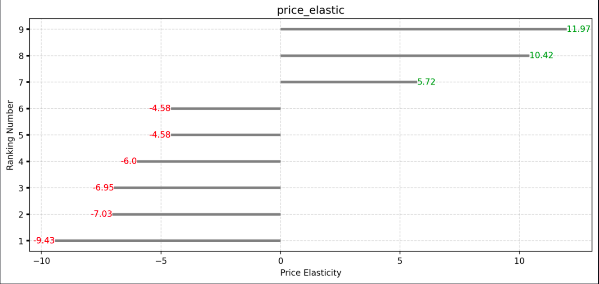

## Elasticidade de Preço e Demanda

### Introdução

Na análise da demanda do consumidor, estamos interessados em conhecer o efeito da variação do preço de um bem sobre sua quantidade demandada, enquanto todos os outros fatores, como renda, preços de outros bens e gostos individuais, permanecem fixos. Se outros fatores não forem mantidos fixos, não poderemos conhecer o efeito causal de uma variação do preço sobre a quantidade demandada.

### Preço e Demanda: Uma Relação Fundamental

A oferta e a demanda são as principais forças que impulsionam o comportamento do mercado. Ao analisar o preço em relação à demanda, podemos observar como as vendas de um produto se comportam à medida que seu preço muda.

### Elasticidade Preço-Demanda:

A elasticidade preço-demanda indica a sensibilidade da quantidade demandada de um bem a mudanças em seu preço. Ela é medida pela razão entre a variação percentual da quantidade demandada e a variação percentual do preço.

## e = (Δ%Q) / (Δ%P)
### Onde:

* **e** representa a **elasticidade da demanda**, que indica a sensibilidade da quantidade demandada de um bem a mudanças no seu preço.
* **Δ%Q** representa a **variação percentual na quantidade demandada**. É a diferença entre a quantidade demandada antes e depois da mudança de preço, expressa em porcentagem.
* **Δ%P** representa a **variação percentual no preço**. É a diferença entre o preço antes e depois da mudança, expressa em porcentagem.

**Tipos de Elasticidade Preço-Demanda:**

* **Demanda Elástica (e > 1):** A quantidade demandada muda proporcionalmente mais do que o preço. Ou seja, um pequeno aumento no preço leva a uma grande queda na quantidade demandada, e vice-versa.
* **Demanda Unitária (e = 1):** A variação percentual da quantidade demandada é igual à variação percentual do preço.
* **Demanda In elástica (e < 1):** A quantidade demandada muda menos do que o preço. Ou seja, um grande aumento no preço leva a uma pequena queda na quantidade demandada, e vice-versa.
* **Demanda Perfeitamente In elástica (e = 0):** A quantidade demandada não muda com o preço.

### A baixo está um grafico demostrando a elasticidade do preço dos produtos analisados

### Elasticidade  de preço cruzada:
A elasticidade de preço cruzada analisa como a mudança de preço em um produto afeta a demanda em outro produto.

- Elasticidade de preço cruzada positiva: ocorre quando o aumento no preço de um produto leva os clientes a comprarem outro produto relacionado, indicando que esses produtos são substitutos.

- Elasticidade de preço cruzada negativa: ocorre quando a demanda por um produto diminui em resposta ao aumento no preço de um produto relacionado, indicando que os dois produtos são complementares.

- Elasticidade de preço cruzada nula: ocorre quando não há relação entre a variação no preço de um produto e a quantidade demandada de outro.

### No dataframe abaixo, é possível analisar a correlação entre os produtos e como a mudança de preço de um produto pode afetar os outros.

### Análise da Elasticidade Preço-Demanda: Aplicações

A análise da elasticidade preço-demanda é crucial para empresas tomarem decisões estratégicas sobre preços, marketing e produção. Por exemplo, empresas podem:

* **Definir preços com mais precisão:** Compreendendo a elasticidade da demanda, as empresas podem definir preços que maximizem seus lucros.
* **Identificar oportunidades de mercado:** Bens com alta elasticidade podem apresentar oportunidades para promoções ou expansão da oferta.
* **Desenvolver estratégias de marketing:** A elasticidade da demanda pode direcionar campanhas de marketing para diferentes segmentos de consumidores.

### Considerações Finais

A elasticidade de preço pode ser aplicada para compreender como o seu produto se comporta diante de diferentes flutuações de preço, possibilitando a maximização do lucro e o desenvolvimento de diversas estratégias.

